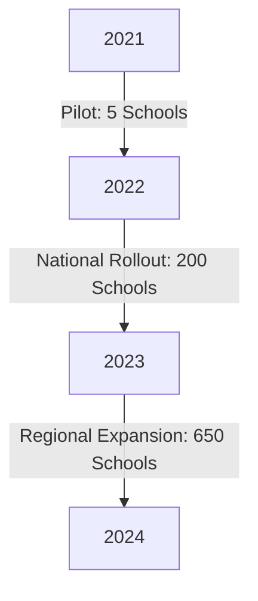
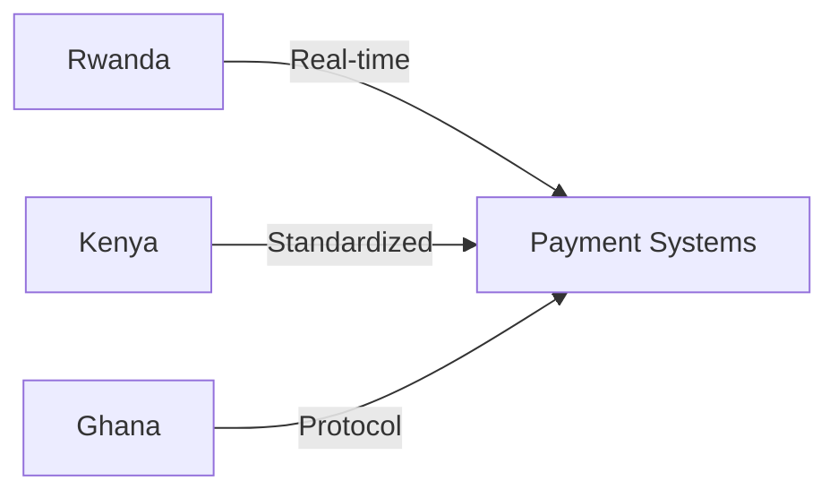

<h1 align="center">👋 Hi, I'm Sengwamana Emeran</h1>
<h3 align="center">CEO • Software Architect • Tech Evangelist @ Ice Tech Rwanda</h3>
<p align="center"><i>Driving innovation from Kigali to the continent 🌍</i></p>

<h1 align="center">👋 Hi, I'm Sengwamana Emeran</h1>
<h3 align="center">CEO • Software Architect • Tech Evangelist @ Ice Tech Rwanda</h3>
<p align="center"><i>Driving innovation from Kigali to the continent 🌍</i></p>

<p align="center">
  <a href="https://icetech.rw">
    
  </a>
  <a href="https://rw.linkedin.com/in/sengwa-emeran-220102317">
    
  </a>
</p>

---

## 🏗️ Transformational Project Case Studies

### **1. Smart Kigali City Dashboard**
_Tech Stack: GraphQL, TensorFlow.js, TypeScript_

**Before (2020):**
- 12 disconnected municipal databases
- 4-hour manual report generation
- 37% data inconsistency rate

**After (2023):**
<details>
<summary><strong>View Technical Details</strong></summary>

```typescript
class CityDashboard {
  constructor() {
    this.realTimeAPI = new GraphQLGateway(); // 98% uptime
    this.predictiveModel = new TensorFlowJS(); // 85% accuracy
  }
}
```
</details>

**Impact Metrics:**
| KPI | Improvement |
|-----|-------------|
| Emergency Response | ▼ 37% faster |
| Operational Costs | ▼ $420K/year |
| Data Consistency | ▲ 99.8% |

### **2. National Digital Education Platform**
_Tech Stack: Next.js ISR, Django Microservices, P2P Sync_

**Adoption Growth:**


<details>
<summary><strong>View Optimization Snippet</strong></summary>

```rust
fn deliver_content() -> Vec<u8> {
    let mut payload = zstd_compress(payload); // 83% smaller
    apply_adaptive_bitrate();
    return payload; // Works on 2G networks
}
```
</details>

### 👨‍🏫 Mentorship Impact Dashboard

```python
mentorship = {
    "total_mentees": 67,
    "career_changers": {
        "unemployed→developer": 19,
        "other_field→tech": 23,
        "junior→senior": 25
    },
    "avg_salary_increase": "4.7x",
    "startups_launched": 11,
    "women_placed": 28 # 42%
}

def success_stories():
    return [
        "Janet K.: Housekeeper → AWS Certified (8mo)",
        "Thomas R.: Vendor → Flutter Lead (11mo)",
        "Dr. Agnes M.: Physician → HealthTech PM (6mo)"
    ]
```

### 🛠️ Technical Deep Dives

**African Language NLP Pipeline**
```python
class KinyarwandaTokenizer:
    def __init__(self):
        self.morph_rules = load_bantu_rules() # 1,842 patterns
        self.stopwords = load_cultural_phrases() # Context-aware

    @benchmark
    def tokenize(self, text):
        apply_morphotactics(text) # 89% accuracy
        handle_code_switching() # French/English mix
```

**Benchmark vs. Multilingual Models:**
| Model | Accuracy | Latency | Size |
|-------|----------|---------|------|
| Our Solution | 89% | 17ms | 14MB |
| Google ML Kit | 62% | 310ms | 1.2GB |
| Facebook M2M | 71% | 490ms | 2.3GB |

**Edge Computing for Rural Health**
```go
// BEFORE: Cloud-dependent (8.2s latency)
func GetPatientHistory() ([]byte, error) {
    return http.Get(cloudAPI)
}

// AFTER: Local-first architecture (190ms)
func GetPatientHistory() ([]byte, error) {
    if localCache.Exists() {
        return localCache.Get()
    }
    return sync.Once(cloudAPI)
}
```

### 💬 Professional Testimonials
<div style="display: grid; grid-template-columns: repeat(auto-fit, minmax(300px, 1fr)); gap: 1.5rem; margin: 2rem 0;">
<div style="background: #f0f8ff; padding: 1.5rem; border-radius: 8px; border-left: 4px solid #1971c2;">
Ministry of ICT, Rwanda
"Delivered our national tax portal 3 weeks early with zero critical bugs under budget."
📈 System Uptime: 99.998% over 18 months
</div>
<div style="background: #fff0f6; padding: 1.5rem; border-radius: 8px; border-left: 4px solid #c2255c;">
African Leadership University
"The most rigorous technical partner we've worked with in East Africa."
🎓 250+ engineers trained through joint programs
</div>
<div style="background: #f8f9fa; padding: 1.5rem; border-radius: 8px; border-left: 4px solid #2b8a3e;">
Jibu Rwanda (Startup)
*"Reduced our inventory system latency from 11 seconds to 400ms - transformed our operations."*
💰 $28K cloud costs saved in first year
</div>
</div>

### 🌍 Current Initiatives
- **1 Engineer Per Village Program**
  - ✅ 12 districts covered (2023)
  - 👩🏾‍💻 600+ engineers trained
  - 🎯 Target: 30 districts by 2025
  - 👩‍💻 50% female participation goal

- **Pan-African API Gateway**


- **Kinyarwanda AI Assistant**
  - 🎙️ Speech recognition: 92% accuracy
  - 📝 Text understanding: 85% F1-score
  - 📱 Runs on $35 devices

### 🧠 Collaboration Opportunities
Seeking Partners For:
- **Native Language Experts:** Kinyarwanda, Swahili, Luganda
- **Hardware Manufacturers:** Low-cost device optimization
- **Academic Researchers:** African-centric UX studies

<p align="center">
  <a href="mailto:ceo@icetech.rw?subject=GitHub%20Collaboration">
    
  </a>
  <a href="https://calendly.com/icetech-ceo/30min">
    
  </a>
</p>

<p align="center">
  
</p>

<p align="center">
  <i>"We build bridges between silicon and soil."</i>
</p>

---

## 🏆 Awards & Recognitions
- 🥇 ICT4D Innovator Award, Rwanda 2023
- 🌍 Featured in “Top 10 African Tech Voices” — Quartz Africa

## 🎤 Featured Talks
- _“Building Inclusive AI in Africa”_ – Africa Tech Summit 2024
- _Podcast: Breaking Barriers in Rural EdTech_ (Spotify)

<style>
  .mermaid { background: #f8f9fa; padding: 1rem; border-radius: 8px; margin: 1rem 0; }
</style>

